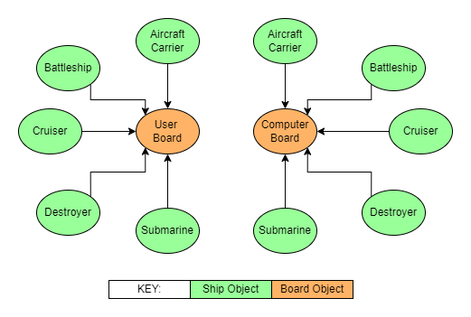

# Battleships Game

 

** **STILL TO BE EDITTED FROM PREVIOUS PROJECT** **

  

TO DO
* Game Features
* Error Catching
* Testing
* Bugs
* Flow chart
* Future Enhancements
* Intro
* User stories
* Target audience
* Styling
* Contents

## Site Overview

## Contents
1. [Site Overview](#site-overview)
1. [Planning](#planning)
    * [Target Audience](#target-audience)
    * [User Stories](#user-stories)
    * [Flowcharts](#flowcharts)
    * [Styling](#styling)
1. [Features](#features)
    * [Navigation](#navigation)
1. [Future Enhancements](#future-enhancements)
1. [Technology Used](#technology-used)
1. [Testing](#testing)
    * [Functionality Testing](#functionality-testing)
    * [Compatibility Testing](#compatibility-testing)
    * [Performance Testing](#performance-testing)
    * [Validator Testing](#validator-testing)
    * [Bugs](#bugs)
    * [Unfixed Bugs](#unfixed-bugs)
1. [Deployment](#deployment)
    * [GitHub Pages](#github-pages)
    * [Cloning Repository](#cloning-repository)
1. [Credits](#credits)
    * [Content](#content)
    * [Media](#media)

## Planning
### Target Audience **EDIT**
* Users who wish to engage in a more complex version of Rock, Paper, Scissors.
* Users who are looking to design and code interactive games themselves.
* Younger users who are looking to play a simple, engaging game with a short duration.
* Users who are looking to interactively learn the rules of Rock, Paper, Scissors, Lizard, Spock to play externally with friends.

### User Stories **EDIT**
* As a user, I want a simple, clean layout, providing everything I need for smooth gameplay.
* As a user, I want to easily access instructions on how to play the game.
* As a user, I want to easily select my chosen attack in an intuitive manner.
* As a user, I want to easily view the winner of each point and receive an explanation of the result.
* As a user, I want to easily reset the game to play again as many times as desired.

### Game Brief
* 1990 Milton Bradley rules: https://en.wikipedia.org/wiki/Battleship_(game)

### Flowcharts
* Flowcharts were created to plan the logic and feature paths of the game, and to organise the content into actionable sections.

## Data Model
### Classes
This project used Object Oriented programming, consisting of two main classes - Ship and Board. There are 5 different instances of the Ship class and 2 instances of the Board class (one for each player). Each player board receives all five ship instances to be assigned locations on the grid.

1. Ship
    * Aircraft Cruiser
    * Battleship
    * Cruiser
    * Destroyer
    * Submarine
1. Board
    * User
    * Computer

### Styling
Styling of 
* Gameboard
* Narrative

## Features

* Welcome screen
* Instructions / Rules
* User name input
* Setup type (Automatic/manual)
* Battle commencement
* Error handling
* Player Win
* Computer Win
* 

### Game Introduction
Upon loading the page, the user is provided with an overview of the game, including the different ship types and the key for hit/miss symbols on the game board. This is shown upon loading and every time a new game starts.

### Game Area **EDIT**
The game area consists of two player areas - the user and the computer - containing their current score, and their current active image. Images vary dynamically between the attack selection figure, the player's chosen attack, and finally the winner/loser images after the game finishes.

### Responsive Layout **EDIT**
For wider screens, the user and computer game areas are side by side to optimally fill the window area. For thinner screens, such as mobiles and tablets, the player areas are stacked vertically, giving the user the sense of playing directly in front of their opponent. CSS media queries were utilised to optimise the styling across the different screen sizes.

### Integrated Attack Selection **EDIT**
The user selects their attack by clicking directly on the relevant icon in the image. Circular buttons are embedded over the each attack option so the user can intuitively relate their selection to the other possible attacks.

### Countdown Sequence **EDIT**
After the user selects and attack, a countdown sequence is triggered. The words "Rock", "Paper", "Scissors", "Lizard", "Spock" flash in the center of the screen before returning the outcome of the point. This creates anticipation over the result after the user locks in their selection. All selector buttons are disabled for the duration of the countdown to prevent the result from being overridden or from sending unaccepted inputs through the code.

### Outcome Feedback  **EDIT**
The last evaluated result is verbally transcribed in the central area, stating whether the user won/lost/drew and providing an explanation of the combination behind the scoring. The winner and loser's scores are displayed in green and red respectively to provide an instant visual indicator of the victor. Additionally, the result text is responsively coloured in accordance with the user's outcome.

### Declaring the Winner **EDIT**
Once either player reaches 10 points the winner is declared, returning a trophy image to the victor's game area and a red cross to the loser's game area. All selector buttons are prevented from triggering from this point onwards, until the user selects to reset the game and play again. Should a selector be pressed, a Sweet Alert message will appear to reiterate this to the user.

### Error Catching
Errors caught:

Coordinate inputs checks if:
* Two characters were not provided
* First character is not a letter
* Second character is not a decimal number
* First character is out of bounds of the board
* Second character is out of bounds of the board
* The coordinates have previously been guessed

## Future Enhancements
Various additional features would bring a greater user experience to the website:
* Allow the user to manually place their ships by selecting the coordinates for the front of the ship and dictating whether it the remaining divisions of the ship trail right or downward.
* The addition of feature selecting coordinates for the computer in cells adjacent to a direct hit. 
* Refactor code for printing the player boards to the console
* Multiplayer **EDIT**
* Audio **EDIT**

## Technology Used
* [Python 3](https://www.python.org/downloads/) - Game code
* [GitPod](https://www.gitpod.io/) - IDE for local development
* [GIT](https://git-scm.com/) - Version Control
* [GitHub](https://github.com/) - to host the repositories for this project and the live website preview
* [Heroku](https://www.heroku.com/home) - Site deployment

## Libraries
Three imported libraries were utilised in this project:

### random
random.randint() was used to randomly obtain an index from 0 to the board width and random.choice() were used to randomly select elements from lists. These were used in functions for generating the direction and coordinates when placing the ships and for generating computer guesses. 

### os
<code>os.system()</code> was used to clear the terminal of data. This was used in the <code>clear_console()</code> function which was used to control the game layout. <code>os.name</code> was also used to tailor the code depending on the operating system.

### copy
<code>copy.deepcopy()</code> was used to create duplicate nested lists which had no dependencies on the original list. Other conventional techniques for copying lists such as <code>old_list.copy()</code> and <code>old_list[:]</code> modified the original list when manipulating the duplicated nested list and therefore were not sufficient for the feature.

## Testing

* Letting computer win - show board

#### Robustness Testing
 * Frequency testing - testing over and over again.
 * Test the random positioning of ships over 100 times

### Functionality Testing
* **Test 🧪** - 
    * **Result 🏆** - 
    * **Verdict ✅** - 

* **Test 🧪** - 
    * **Result 🏆** - 
    * **Verdict ✅** - 

* **Test 🧪** - 
    * **Result 🏆** - 
    * **Verdict ✅** - 

* **Test 🧪** - 
    * **Result 🏆** - 
    * **Verdict ✅** - 

* **Test 🧪** - 
    * **Result 🏆** - 
    * **Verdict ✅** - 

* **Test** - All buttons were clicked to check they performed the desired outcome.
    * **Outcome** - All 5 attack selector buttons sent the appropriate data-type attribute when clicked, triggering the correct event listener code. The 'Reset Game' button correctly executed the resetBoard() function, the 'Instructions' button overlaid the instructions content, and the 'Play' button resumed the game from the last recorded since (0-0 upon loading). The GitHub button previously contained an anchor tag linking to the GitHub page, though the user was only redirected when clicking on the text, and the button body triggered an unknown data-type issue in the event listener logic. Consequently, the anchor tag was removed and the user was redirected to the site via JavaScript when clicking on any part of the button. 

* **Test** - Checked all keyboard shortcut commands operated correctly, 
    * **Outcome** - Pressing the 1-5 keys on the keyboards correctly triggered the attacks from rock through to spock respectively. Pressing the 'R', 'I' and 'P' keys on the keyboard executed the same code as the 'Reset Game', 'Instructions' and 'Play' buttons respectively, as explained above.

* **Test** - All images on the website displayed correctly.
    * **Outcome** - All user attacks were selected to check that the correct images were displayed in the user area upon revealing the result. This was also checked for the computer's selection by ensuring the returned image matched the output of <code>console.log(cpuSelection)</code>. Similarly, the images for the winner and loser of the game were checked using <code>console.log(victor))</code> within the <code>declareWinner()</code> function. It was also verified that the main selection was re-displayed after 3 seconds of revealing the result for all attack options.

* **Test** - Testing errors were caught correctly.
    * **Outcome** - After the winner was declared, all the selector buttons and 1-5 keys were pressed to check if the countdown sequence was triggered. For all cases the Sweet Alert function intervened to inform the user to reset the game to continue playing, ensuring that the user could not continuously play the game with no end.

* **Test** - Checking the score bar for the computer moved below the image on smaller screens.
    * **Outcome** - <code>console.log('threshold crossed')</code> was used to check that the  <code>moveScore()</code> function was executing correctly. This message is displayed in the console every time the window size crossed the stacking threshold of 800px. The window was dragged to small and large widths several times, and the score bar moved appropriately to optimise the viewing of the content.

### Compatibility Testing
* **Test 🧪** - Testing the imported libraries were fully functional in multiple workspaces.
    * **Result 🏆** - The colorama imported python library was supported within GitPod, however was not supported in the deployed Heroku terminal. All other imported libraries loaded successfully.
    * **Verdict ✅** - This test failed the initial assessment, however, refactoring the code to incorporate escape characters relieved the need to import an additional library for colour alteration.

* **Test 🧪** - Testing the final code in multiple terminals.
    * **Result 🏆** - All operations were working successfully in both GitPod and the deployed Heroku terminal.
    * **Verdict ✅** - This test passed, frequent assessment of the compatibility of code in both terminals ensured a pass was maintained.

* **Test 🧪** - 
    * **Result 🏆** - 
    * **Verdict ✅** - 

* **Test 🧪** - 
    * **Result 🏆** - 
    * **Verdict ✅** - 

* **Test 🧪** - 
    * **Result 🏆** - 
    * **Verdict ✅** - 

* **Test 🧪** - 
    * **Result 🏆** - 
    * **Verdict ✅** - 

* **Test 🧪** - 
    * **Result 🏆** - 
    * **Verdict ✅** - 

* **Test** - Testing responsivity across various screen sizes.
    * **Outcome** - The website was tested for responsivity across screen sizes of 320px, 768px, 1280px and 1600px in width, coving typical screens for mobiles, tablets, laptops and desktops. Three different laptop sizes and three different mobile phone sizes were used to verify this. Content readability was optimised by altering the size and positioning of elements.

* **Test** - Testing across multiple browsers.
    * **Outcome** - The Developer Tools function was used to test this across Google Chrome, Mozilla Firefox and Microsoft Edge to verify the site was fully responsive across the specified screen widths and across different browsers.

* **Test** - Continuous verification across multiple viewports.
    * **Outcome** - [Am I Responsive](http://ami.responsivedesign.is/#) was frequently used to check the responsiveness of the website across different screen dimensions, ensuring that all content was displayed in the optimal manner.

### Performance Testing
* **Test 🧪** - Frequency testing of the placement of ships, repeating process 50 times.
    * **Result 🏆** - The ships were successfully placed on the board all 50 times, with no over lapping and with the correct number of divisions in each ship.
    * **Verdict ✅** - This test passed, proving that the ship placement was operating correctly and consistently.

### Validator Testing
* No errors were found when running the Python code through the [PEP8 online validator](http://pep8online.com/).
    
### Bugs

* Nested list not copying - import copy - <code>copy.deepcopy(list)</code>
* Two letters rthowing uncaught error
* Not catching duplicate guesses - create list of previous guesses and check list before accepting subsequent guesses as valid
* Checking validation of letter-row coordinate range - convert to unicode number

* **Problem 🐞** - Colorama library not supported in deployed Heroku terminal. <code>ModuleNotFoundError: No module named 'colorama'</code>
    * **Resolution ✅** - The code was refactored to incorporate escape characters, which withdrew the need to import an additional library for colour alteration. The <code>colour_text(text, colour)</code> function was created to wrap colour-dependent escape characters around the inputted text, with the syntax <code>colour_code + text + reset_colour</code>. Since many different colours were frequently printed in the terminal, this function significantly improved the efficiency, readability and troubleshooting of this process.

* **Problem 🐞** - Nested lists not copying to new variable correctly.
    * **Resolution ✅** - 
    . [Adapted from Stack Overflow](https://stackoverflow.com/questions/2541865/copying-nested-lists-in-python)

* **Problem 🐞** - Continual printing of data leading to over-crowded terminal and poor user experience
    * **Resolution ✅** - The terminal was cleared frequently to ensure that the game board was consistently at the top of the terminal. The <code>clear_console()</code> function utilised the <code>os.system('clear')</code> was used to wipe the terminal of data, enabling the presentation of the game to be controlled and styled. [Adapted from DelftStack](https://www.delftstack.com/howto/python/python-clear-console/)

* **Problem 🐞** - 
    * **Resolution ✅** - 

* **Problem 🐞** - 
    * **Resolution ✅** - 

* **Problem 🐞** - 
    * **Resolution ✅** - 

* **Issue** - Generating the winner outcome.
    * **Resolution** - A standardised outcome array was set up for each selection option with the syntax <code>selectionArray = [win, win, lose, lose, draw]</code>, representing the user's outcome relative to the computer's selection. For example <code>rockArray = ['scissors', 'lizard', 'paper', 'spock', 'rock']</code>, where rock beats scissors, loses to paper and so forth. Subsequently, each selection array was nested within the larger <code>cases</code> array, creating one variable from which all combinations could be accessed. This meant that <code>cases[i][j]</code> could be used to create the outcome logic for any combination, where i represented the user's selection, j represented the computer's selection, and the j index determined the user's outcome (win, lose, draw). No tutorials were used when writing the code to determine the winner.

* **Issue** - Embedding selection buttons within the attack options in the image.
    * **Resolution** - Instead of using conventional buttons, absolute positioning was used to position the selector buttons accordingly within the encasing image container div. This meant the user could click on the icon of their attack, rather than from an external point outside of the image. Additionally, positioning using percentages ensured the button orientation was constant across different screen sizes. [Adapted from Stack Overflow](https://stackoverflow.com/questions/24435397/click-particular-region-of-image).

* **Issue** - Creating a countdown feature before revealing the result.
    * **Resolution** - The <code>setTimeout()</code> timing event was used to dynamically cycle through the countdown procedure. The <code>countdown()</code> function contained another <code>setTimeout()</code> that self-referenced the <code>countdown()</code> function, creating a loop of nested time events. The loop was broken using if-statement logic after the countdown iterations were complete. [Adapted from Carl Anderson](https://carlanderson.xyz/creating-timed-sequences-in-javascript-using-settimeout/).

* **Issue** - Capability for selector buttons to be pressed before the countdown sequence was finished.
    * **Resolution** - The <code>buttonIncomplete</code> was initialised to false and was updated to true upon the user selecting an attack. While <code>buttonIncomplete</code> was true, no other attack options could be selected. Once the winner of the point had been declared, it was reassigned back to false and another option could be chosen. Similarly, once either player reached 10 points a Sweet Alert appears to inform the user to reset the game, and the selectors would not initiate the countdown sequence.

* **Issue** - Dynamically hiding elements from view during gameplay.
    * **Resolution** - Main games area were assigned and unassigned the .hide class using JavaScript depending on whether they were active or not. Applying <code>display:none</code> allowed for the element to be hidden from view and also occupy no space on the screen. A separate .hide-visible class was applied to elements in the center area such as the result and countdown text. This instead applied <code>visibility:hidden</code> to hide the content from view while keeping the structural integrity of the HTML. [Adapted from Career Karma](https://careerkarma.com/blog/css-hide-element/).

* **Issue** - Functions running immediately when assigning event listeners.
    * **Resolution** - The syntax of the listener was assigned to <code>() => functionName(variable))</code> instead of simply <code>functionName(variable)</code>. If no variables were passed into the function, passing only <code>functionName</code> prevented the immediate running of the function. [Adapted from Stack Overflow](https://stackoverflow.com/questions/16310423/addeventlistener-calls-the-function-without-me-even-asking-it-to).
    
* **Issue** - Alerts disturbing the flow of events.
    * **Resolution** - Since the browser was forced to read <code>alert()</code> commands immediately, preceding code which had not been fully executed was stalled. For example the declaration of the winner stalled the rendering of images. The integration of sweetalert2 enabled alerts to be displayed dynamically without forcing all other code to stop. [Adapted from Sweet Alert](https://sweetalert2.github.io/).

* **Issue** - Resetting the board after each outcome was declared.
    * **Resolution** - To keep a fast paced flow to the game, after declaring the winner of each point the images of each player's attack were shown for two seconds before returning to the selection image. The <code>setTimeout()</code>, meaning the user did not need to press a button to acknowledge the result. The result text, however, remained unchanged in the center, should the player have missed the combination from the images.

* **Issue** - Moving score locations when vertically stacking player areas.
    * **Resolution** - For the horizontal orientation on larger screens, both players' scores are above their game image. However, when stacking vertically, this meant that the scores were not in close proximity and the user needed to actively seek out each score individually. Therefore, the simple <code>stackScore()</code> function was created to rearrange the computer's score below the image, having both score in the central region. This was triggered by the screen size crossing below the threshold for vertical stacking (800px) and reset to the default above the threshold. 

### Unfixed Bugs
There are no known bugs left unfixed.

* Required use of global variables for username and player boards to function. Removing the global variable required the players to be passed through each function they were used in.

## Deployment
### GitHub Pages
This app was created using the [python essentials template](https://github.com/Code-Institute-Org/python-essentials-template) developed by the Code Institute and the site was deployed to Heroku. The steps to deploy are as follows:
1. From the user dashboard select 'Create New App'.
1. Enter a unique app name and select the current region. This project was deployed from the UK, Europe.
1. Once the skeleton of the app has been created, navigate to the 'Settings' tab.
1. Click 'Reveal Config Vars' and type in "PORT" to the 'KEY' field and "8000" to the 'VALUE' field. Press Add to confirm.
1. Click 'Add buildpack' and type in "heroku/python" and then click 'Save changes'. Alternatively click on the python icon to auto-fill the field with "heroku/python".
1. Click 'Add buildpack' again and type in "heroku/nodejs" and then click 'Save changes'. Alternatively click on the nodejs icon to auto-fill the field with "heroku/nodejs".
1. Ensure the order of the buildpacks starts with "heroku/python" and is followed by "heroku/nodejs".
1. Navigate to the 'Deploy' tab in the app menu.
1. Under the 'Deployment method' subsection select GitHub and click 'Connect to GitHub'.
1. In the 'repo-name' field type the repository name and click search, and then below click 'Connect'. In this case the repo-name was "battleships".
1. Under the 'Automatic deploys' subsection click 'Enable Automatic Deploys'.
1. After the app has been deployed, click 'View' to open the deployed site in a new tab. Alternatively, scroll to the top of the app workspace and click 'Open app'.
1. The live link can be found here - https://github.com/bens6477/battleships

### Cloning Repository
You can clone this repository to view, edit and run the code. The steps to clone the repository are as follows:

1. Within the repository, navigate to the 'Code' drop-down menu, select 'HTTP' and copy the URL.
1. Open Git Bash from your IDE of choice.
1. Navigate the current working directory to your desired location.
1. To clone the repository, type <code>git clone</code> into the terminal followed by the repository URL, in this case <code>git clone https://github.com/bens6477/battleships</code>.
1. Press 'Enter'.

## Credits
### Content
* Providing alternative colours for text in the terminal using escape characters - [Stack Overflow](https://stackoverflow.com/questions/287871/how-to-print-colored-text-to-the-terminal)
* Function to clear console - [DelftStack](https://www.delftstack.com/howto/python/python-clear-console/)
* Deep-copying nested lists - [Stack Overflow](https://stackoverflow.com/questions/2541865/copying-nested-lists-in-python)
* In-context code credits are provided in the [Bugs](#bugs) section.

### Media
* Flowcharts were created using [diagrams.net](https://app.diagrams.net/).