# Battleships Game

## Site Overview
This project uses a mock terminal deployed in Heroku to host a computerised version of the classic board game Battleships. 

Based on the original [1990 Milton Bradley game rules](https://www.hasbro.com/common/instruct/Battleship.PDF), each player has 5 ships in their fleet, and players take turns guessing the coordinates of their opponent's ships. If the player guesses correctly, a red X is placed in the cell, and if it is wrong it's filled with a yellow ⌀. The first player to sink all of their opponent's ship wins. 

This app is a simple, fast-paced app which you can play against the computer in a short-duration. Do you have what it takes to beat the computer?

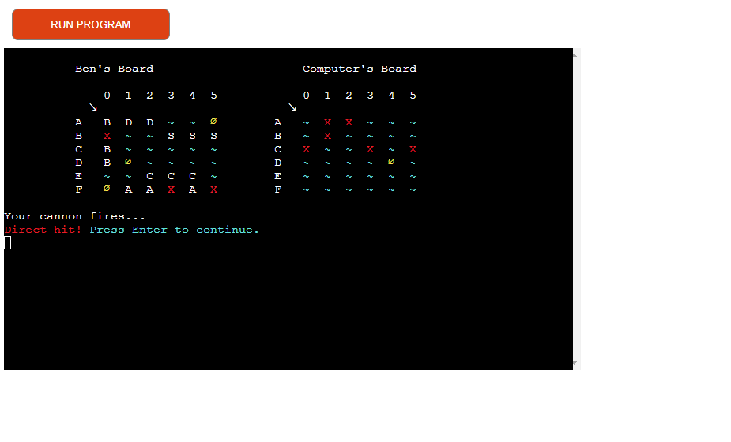

## Contents
1. [Site Overview](#site-overview)
1. [Planning](#planning)
    * [Target Audience](#target-audience)
    * [User Stories](#user-stories)
    * [Data Model](#data-model)
    * [Flowcharts](#flowcharts)
    * [Styling](#styling)
1. [Features](#features)
    * [Game Introduction](#game-introduction)
    * [Defensive Design](#defensive-design)
    * [User Name Input](#user-name-input)
    * [Ship Placement](#ship-placement)
    * [Valid User Guess](#valid-user-guess)
    * [Randomised Computer Guess](#randomised-computer-guess)
    * [Shot Outcome](#shot-outcome)
    * [Game Winner](#game-winner)
    * [Play Again](#play-again)
1. [Future Enhancements](#future-enhancements)
1. [Technology Used](#technology-used)
1. [Libraries](#libraries)
    * [random](#random)
    * [os](#os)
    * [copy](#copy)
1. [Testing](#testing)
    * [Functionality Testing](#functionality-testing)
    * [Validator Testing](#validator-testing)
    * [Bugs](#bugs)
    * [Unfixed Bugs](#unfixed-bugs)
1. [Deployment](#deployment)
    * [Heroku](#heroku)
    * [Cloning Repository](#cloning-repository)
1. [Credits](#credits)

## Planning
### Target Audience
* Users who wish to play and enjoyable game of Battleships.
* Users who are looking to design and code interactive games themselves.
* Users who are looking to play a simple, engaging game with a short duration.

### User Stories
As a user, I want:
* A simple, clean layout, providing everything I need for smooth gameplay.
* To view instructions on how to play the game.
* To view a clean game area with only the essential information for each stage.
* To easily input data in an intuitive manner.
* To be clearly informed of errors when I've given invalid information. 
* To easily view the outcome of each guess.
* To easily reset the game to play again as many times as desired.

### Data Model
This project used Object Oriented programming, consisting of two main classes - Ship and Board. There are 5 different instances of the Ship class and 2 instances of the Board class (one for each player). Each player board receives all five ship instances to be assigned locations on the grid.

1. Ship
    * Aircraft Cruiser
    * Battleship
    * Cruiser
    * Destroyer
    * Submarine
1. Board
    * User
    * Computer

### Flowcharts
* Flowcharts were created to plan the logic and feature paths of the game, and to organise the content into actionable sections.

[View image in new tab:](https://raw.githubusercontent.com/bens6477/battleships/main/assets/images/logic-flowchart.png)

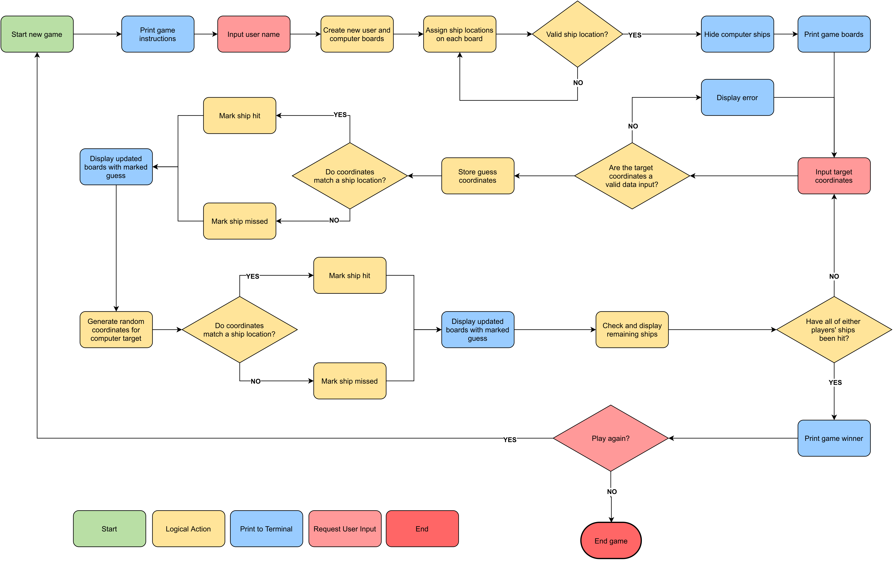

### Styling
#### Game Area

The game area consists of two player board - the user and the computer - containing their name and grid map. The cell symbols vary dynamically depending on the contents of the cell and the outcome of chosen coordinates.

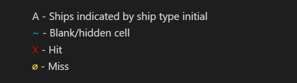

* The user can see the locations of each of their ships, however the locations of the computer's ships are hidden. The player's aim is to successfully guess the locations all of their opponent's ships.

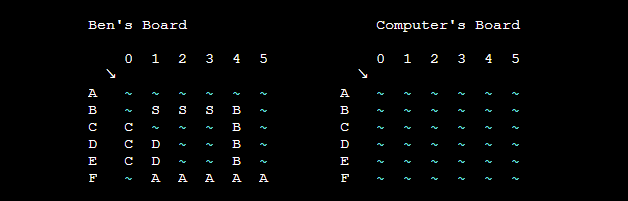

#### Text Colouring
* Specific phrases and characters are assigned different colours depending on the data they represent.
* User input requests are printed in green to emphasise the required action to the user.
* "Enter to continue" messages are printed in blue to also draw attention, however to differentiate between inputting data and simply pressing Enter.
* This improves the readability of the game and improves the user experience as the player can differentiate between data quickly and it is much more pleasing to look at.

Colour dependent data is as follows:
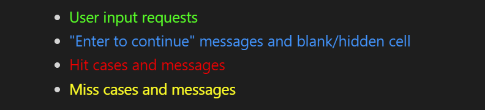

## Features

* Welcome screen
* Instructions / Rules
* User name input
* Setup type (Automatic/manual)
* Battle commencement
* Error handling
* Player Win
* Computer Win
* 

### Game Introduction
Upon loading the page, the user is provided with an overview of the game, including the different ship types and the key for hit/miss symbols on the game board. This is shown upon loading and every time a new game starts.

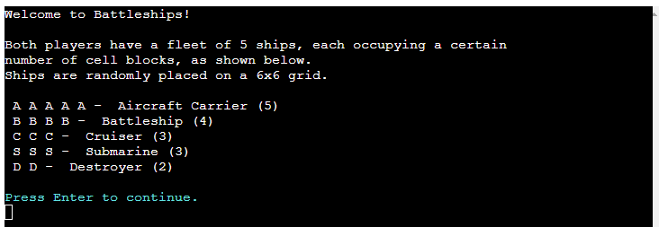
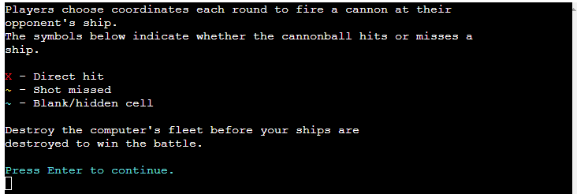

### Defensive Design
* Whenever the user is requested to input information, it is passed through several error handling cases to ensure that the data is valid. This is to ensure that the user does not unintentionally (or intentionally) break the game by inserting improper information.
* A defensive design approach was used to predict and catch the potential cases which could break the program or which would result in poorer user experience. 
* try-except-else statements were used to run test cases, catch and return errors, and run code where no exceptions were present.
* Customised error messages were created for each case, informing the user of what caused the error.
* This is used to check that only one error is throwing at a a time and to check that errors are not overwriting each other.
* Exception handling is used at 3 sections in the program:
    1. Inputting user name
    1. Inputting target coordinates
    1. Inputting if the user would like to play again

### User Name Input
The user is prompted to input their chosen user name. The program will only progress when a valid user name has been submitted. Built in error handling cases were created to prevent the user from inserting an invalid user name and to inform the user of the error in their submission:
1. The user name cannot be left blank.
    * A ValueError is returned when the submitted string length is zero - <code>len(user_name) == 0</code>
1. The user name cannot be longer than 10 characters.
    * A ValueError is returned when the submitted string length is greater than 10 characters - <code>len(user_name) > 10</code>
1. The user name cannot be the same as the Computer.
    * A ValueError is returned when the lowercase of the submitted string length equal to "computer" - <code>user_name.lower() == "computer"</code>.

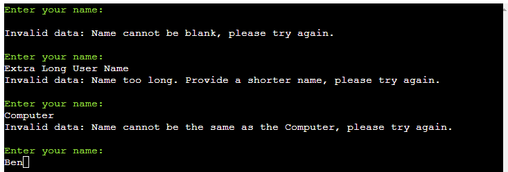

### Ship Placement
* Each ship is placed by randomly selecting a starting coordinate and randomly selecting a direction of either "right" or "down". From the starting point, The divisions of the ship are printed to adjacent cells from the starting point in the specified direction.
* The <code>ship.placement_range</code> attribute is used to randomise the starting position of the ships depending on the length of the ship and how many cells it requires to print in full.
* The <code>is_ship_already_here()</code> function is used to check that there are no ships already located in any of the cells before placing the ship.

### Valid User Guess
* The user is requested to input target coordinates in the form of "A4" (letter then number). The program will only progress when valid target coordinates has been submitted. Built in error handling cases were created to prevent the user from inserting an invalid user name and to inform the user of the error in their submission:
1. The coordinates must contain 2 characters.
    * A ValueError is returned when <code>len(guess) != 2</code>
1. The first character must be a letter.
    * A ValueError is returned when <code>not guess[0].isalpha()</code>
1. The second character must be a decimal number.
    * A ValueError is returned when <code>not guess[1].isdigit()</code>
1. The first character must be a letter between "A" and the letter of the last row.
    * A ValueError is returned when <code>(ord(guess[0].lower()) < 97 or ord(guess[0].lower()) > (96 + BOARD_SIZE))</code>
1. The second character must be a number between0 and the number of the last column
    * A ValueError is returned when <code>(int(guess[1]) > BOARD_SIZE - 1)</code>
1. The coordinates must not have already been guessed.
    * A ValueError is returned when <code>num_guess in player.previous_guesses</code>

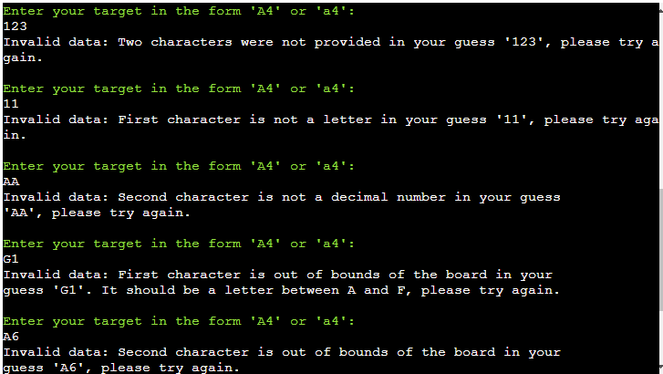
 

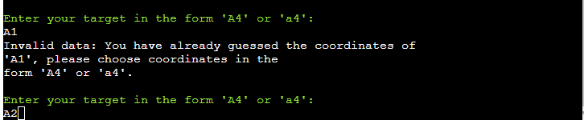

### Randomised Computer Guess
* Computer guesses were randomly selected on the grid using the imported random library.
* random.randint() was used to randomly obtain an index from 0 to the board width and random.choice() were used to randomly select elements from lists.
* These were used in functions for generating the direction and coordinates when placing the ships and for generating computer guesses.

### Shot Outcome
* After each shot the user is informed about the outcome of their selection - hit or miss. Colour-coded messages are printed to easily identify the outcome and the relevant symbol is printed to the board. 
* Before the computer takes its shot, the user must press Enter to acknowledge the passing of play and to draw attention to only one player's shot at a time.

## Game Winner
Once either player has no ships left the winner is declared. A colour-coded message is printed stating whether the user won, lost or drew.

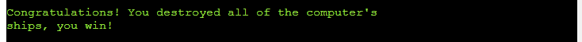
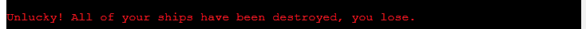
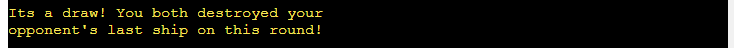

### Play Again
* After the battle has finished and the winner is declared, the user is asked if they would like to play again. The user  A simple Y/N is 
* The program will only progress when a valid response has been submitted. Built in error handling cases were created to prevent the user from inserting an invalid response and to inform the user of the error in their submission:
1. The Y/N response cannot be left blank.
    * A ValueError is returned when the submitted string length is zero - <code>len(another_game) == 0</code>
1. The Y/N response cannot be longer than 1 character.
    * A ValueError is returned when the submitted string length is greater than 1 character - <code>len(another_game) > 1</code>
1. The Y/N response must only be either a "Y" or an "N", upper- or lowercase.
    * A ValueError is returned when the unicode of the submitted string is not equal to "Y" or "N" - <code>ord(another_game.lower())</code>.

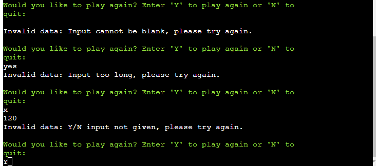

## Future Enhancements
Various additional features would bring a greater user experience to the website:
* The addition of multiplayer functionality where two people can play against each other on the same device. Players take turns to select coordinates, and after each turn there is a pause and handover screen to prevent the opponents from seeing ship locations.
* Allow the user to manually place their ships by selecting the coordinates for the front of the ship and dictating whether it the remaining divisions of the ship trail right or downward.
* The addition of feature selecting coordinates for the computer in cells adjacent to a direct hit. This would make the computer guesses smarter and harder to beat.
* Refactor code for printing the player boards to the console

## Technology Used
* [Python 3](https://www.python.org/downloads/) - Game code
* [GitPod](https://www.gitpod.io/) - IDE for local development
* [GIT](https://git-scm.com/) - Version Control
* [GitHub](https://github.com/) - to host the repositories for this project and the live website preview
* [Heroku](https://www.heroku.com/home) - Site deployment

## Libraries
Three imported libraries were utilised in this project:

### random
random.randint() was used to randomly obtain an index from 0 to the board width and random.choice() were used to randomly select elements from lists. These were used in functions for generating the direction and coordinates when placing the ships and for generating computer guesses. 

### os
<code>os.system()</code> was used to clear the terminal of data. This was used in the <code>clear_console()</code> function which was used to control the game layout. <code>os.name</code> was also used to tailor the code depending on the operating system.

### copy
<code>copy.deepcopy()</code> was used to create duplicate nested lists which had no dependencies on the original list. Other conventional techniques for copying lists such as <code>old_list.copy()</code> and <code>old_list[:]</code> modified the original list when manipulating the duplicated nested list and therefore were not sufficient for the feature.

## Testing
### Functionality Testing
* **Test 🧪** - Frequency testing of the placement of ships, repeating process 50 times.
    * **Result 🏆** - The ships were successfully placed on the board all 50 times, with no over lapping and with the correct number of divisions in each ship.
    * **Verdict ✅** - This test passed, proving that the ship placement was operating correctly and consistently.

* **Test 🧪** - Testing all user name input error handling cases.
    * **Result 🏆** - Input values were submitted as blank, strings of 11 characters and of "computer" and "Computer" and the predicted error messages were printed every time. This accounted for all cases which could cause an error in the code. See image in [Features](#features) section for error messages.
    * **Verdict ✅** - This test passed, as no situation was recorded which caused the code to fail.

* **Test 🧪** - Testing all valid target coordinate input error handling cases.
    * **Result 🏆** - Input values were submitted for each case outlined in [Valid User Guess](#valid-user-guess) section as blank and the predicted error messages were printed every time. This accounted for all cases which could cause an error in the code. See image in [Features](#features) section for error messages.
    * **Verdict ✅** - This test passed, as no situation was recorded which caused the code to fail. As this is the most frequent input for the user, extra care was given to ensure that the code was not broken at this poin.

* **Test 🧪** - Test hit/miss cases.
    * **Result 🏆** - Once valid coordinates were passed, if a ship was present in the cell a red "X" was printed to that cell, and if there was no ship a yellow "⌀" was printed. The computer's ships were un-hidden temporarily to verify this procedure was working on both boards.
    * **Verdict ✅** - This test passed, as relevant symbol was printed to each cell every time.

* **Test 🧪** - Testing all Y/N input error handling cases.
    * **Result 🏆** - Input values were submitted as blank, strings of 2 characters and of non- Y/N characters such as "m", "X", "1" and ".". The predicted error messages were printed every time. This accounted for all cases which could cause an error in the code. The game successfully restarted upon the submission of "Y" and ended with the submission of "N". See image in [Features](#features) section for error messages.
    * **Verdict ✅** - This test passed, as no situation was recorded which caused the code to fail.

* **Test 🧪** - Test for user winning the battle.
    * **Result 🏆** - Target coordinates were inputted to until all of the copmputer's ships were hit. The user 'win' game outcome message was then printed to the console.
    * **Verdict ✅** - This test passed as the user was successfully informed of their win.

* **Test 🧪** - Test for user losing the battle.
    * **Result 🏆** - For this test the computer's ships were revealed (un-hidden) from the user in order to deliberately miss the computer's ships. After the computer has destroyed all of the user's ships the user 'loss' game outcome message was printed to the console.
    * **Verdict ✅** - Since the showing and hidin of the computer's ships has no impact on the outcome of each shot or of the battle, this test was valid for checking the case where the user loses. This approach significanlty reduced the required time to complete the test as unintentional hitting of ships could be avoided.

* **Test 🧪** - Test for user and computer drawing the battle.
    * **Result 🏆** - As this case is highly unlikey to occur, the program environment was altered in order to complete this test. Only one destroyer of length 2 divisions was placed in a 2x2 grid. The user and computer made guesses and when the last division of the destroyer was hit by both players on the same round, the 'draw' battle outcome message was printed to teh console.
    * **Verdict ✅** - Since the test passed on a smaller scale, the outcome would be identical on a larger board with more ships. This approach significanlty reduced the required time to complete the test as only 4 cells were present instead of 36, and since the computer's guesses were unpredictable.

* **Test 🧪** - Checking the score bar updated correctly.
    * **Result 🏆** - After each ship was destroyed the corresponding player's ship-count decreased by 1 until 0 ships were remaining. At this point the game over sequence was initiated.
    * **Verdict ✅** - This test passed as each players' ships remaining were printed accurately after each round.

* **Test 🧪** - Testing the imported libraries were fully functional in multiple workspaces.
    * **Result 🏆** - The colorama imported python library was supported within GitPod, however was not supported in the deployed Heroku terminal. All other imported libraries loaded successfully.
    * **Verdict ✅** - This test failed the initial assessment, however, refactoring the code to incorporate escape characters relieved the need to import an additional library for colour alteration.

* **Test 🧪** - Testing the final code in multiple terminals.
    * **Result 🏆** - All operations were working successfully in both GitPod and the deployed Heroku terminal.
    * **Verdict ✅** - This test passed, frequent assessment of the compatibility of code in both terminals ensured a pass was maintained.

* **Test 🧪** - Testing deployed site across multiple browsers.
    * **Result 🏆** - The deployed Heroku site was successfully tested using Google Chrome, Mozilla Firefox and Microsoft Edge to verify full functionality of the game.
    * **Verdict ✅** - This test passed as, the site functioned successfully accress all browsers.

### Validator Testing
* No errors were found when running the Python code through the [PEP8 online validator](http://pep8online.com/).

### Bugs

* Nested list not copying - import copy - <code>copy.deepcopy(list)</code>
* Two letters throwing uncaught error
* Not catching duplicate guesses - create list of previous guesses and check list before accepting subsequent guesses as valid
* Checking validation of letter-row coordinate range - convert to unicode number

* **Problem 🐞** - Colorama library not supported in deployed Heroku terminal. <code>ModuleNotFoundError: No module named 'colorama'</code>
    * **Resolution ✅** - The code was refactored to incorporate escape characters, which withdrew the need to import an additional library for colour alteration. The <code>colour_text(text, colour)</code> function was created to wrap colour-dependent escape characters around the inputted text, with the syntax <code>colour_code + text + reset_colour</code>. Since many different colours were frequently printed in the terminal, this function significantly improved the efficiency, readability and troubleshooting of this process.

* **Problem 🐞** - Nested lists not copying to new variable correctly.
    * **Resolution ✅** - <code>copy.deepcopy()</code> was used to create duplicate nested lists which had no dependencies on the original list. Other conventional techniques for copying lists such as <code>old_list.copy()</code> and <code>old_list[:]</code> modified the original list when manipulating the duplicated nested list and therefore were not sufficient for the feature. [Adapted from Stack Overflow](https://stackoverflow.com/questions/2541865/copying-nested-lists-in-python)

* **Problem 🐞** - Continual printing of data leading to over-crowded terminal and poor user experience
    * **Resolution ✅** - The terminal was cleared frequently to ensure that the game board was consistently at the top of the terminal. The <code>clear_console()</code> function utilised the <code>os.system('clear')</code> was used to wipe the terminal of data, enabling the presentation of the game to be controlled and styled. [Adapted from DelftStack](https://www.delftstack.com/howto/python/python-clear-console/)

* **Problem 🐞** - Hiding and revealing computer's ships.
    * **Resolution ✅** - Since the computer's fleet was to be hidden during gameplay, the <code>hidden_board</code> Board attribute was created to remove all instances of ship symbols from the board, while keeping the hit, miss and blank cells. <code>hidden_board</code> used <code>copy.deepcopy()</code> to create a full copy of the player board to complete this procedure.

* **Problem 🐞** - Resetting board
    * **Resolution ✅** - Calling the player boards again did not result in the re-initialisation of the boards. Therefore, a copy of a each player board was created and this was used to reset both player boards when creating a new game.

### Unfixed Bugs
* The use of global variableswas required for username and player boards to function. Removing the global variable required the players to be passed through each function they were used in.
* The <code>print_board()</code> function is inefficiently writtent. A cleaner, more precise function would improve readability and troubleshooting.

## Deployment
### Heroku
This app was created using the [python essentials template](https://github.com/Code-Institute-Org/python-essentials-template) developed by the Code Institute and the site was deployed to Heroku. The steps to deploy are as follows:
1. From the user dashboard select 'Create New App'.
1. Enter a unique app name and select the current region. This project was deployed from the UK, Europe.
1. Once the skeleton of the app has been created, navigate to the 'Settings' tab.
1. Click 'Reveal Config Vars' and type in "PORT" to the 'KEY' field and "8000" to the 'VALUE' field. Press Add to confirm.
1. Click 'Add buildpack' and type in "heroku/python" and then click 'Save changes'. Alternatively click on the python icon to auto-fill the field with "heroku/python".
1. Click 'Add buildpack' again and type in "heroku/nodejs" and then click 'Save changes'. Alternatively click on the nodejs icon to auto-fill the field with "heroku/nodejs".
1. Ensure the order of the buildpacks starts with "heroku/python" and is followed by "heroku/nodejs".
1. Navigate to the 'Deploy' tab in the app menu.
1. Under the 'Deployment method' subsection select GitHub and click 'Connect to GitHub'.
1. In the 'repo-name' field type the repository name and click search, and then below click 'Connect'. In this case the repo-name was "battleships".
1. Under the 'Automatic deploys' subsection click 'Enable Automatic Deploys'.
1. After the app has been deployed, click 'View' to open the deployed site in a new tab. Alternatively, scroll to the top of the app workspace and click 'Open app'.
1. The live link can be found here - https://github.com/bens6477/battleships

### Cloning Repository
You can clone this repository to view, edit and run the code. The steps to clone the repository are as follows:

1. Within the repository, navigate to the 'Code' drop-down menu, select 'HTTP' and copy the URL.
1. Open Git Bash from your IDE of choice.
1. Navigate the current working directory to your desired location.
1. To clone the repository, type <code>git clone</code> into the terminal followed by the repository URL, in this case <code>git clone https://github.com/bens6477/battleships</code>.
1. Press 'Enter'.

## Credits
* Providing alternative colours for text in the terminal using escape characters - [Stack Overflow](https://stackoverflow.com/questions/287871/how-to-print-colored-text-to-the-terminal)
* Function to clear console - [DelftStack](https://www.delftstack.com/howto/python/python-clear-console/)
* Deep-copying nested lists - [Stack Overflow](https://stackoverflow.com/questions/2541865/copying-nested-lists-in-python)
* Arrow unicode values - [Unicode Table](https://unicode-table.com/en/sets/arrow-symbols/)
* In-context code credits are provided in the [Bugs](#bugs) section.
* Flowcharts were created using [diagrams.net](https://app.diagrams.net/).
* Python code was vallidated using [PEP8 online validator](http://pep8online.com/).
* [python essentials template](https://github.com/Code-Institute-Org/python-essentials-template) for mock terminal was provided by [Code Institute](https://codeinstitute.net/)
* Game rules were obtained from [1990 Milton Bradley game rules](https://www.hasbro.com/common/instruct/Battleship.PDF)